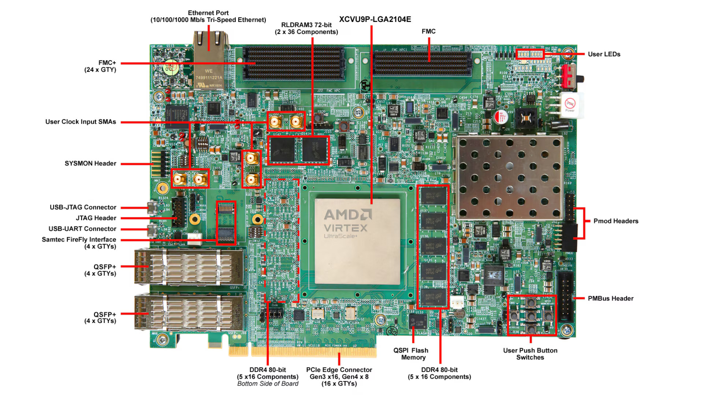

# notes-fpga
Field-Programmable Gate Array (FPGA) [[1]](https://www.ibm.com/think/topics/field-programmable-gate-arrays) Notes and Implementations.  

## 1. Kits

### 1.1 AMD Virtex™ UltraScale+™ FPGA VCU118 Evaluation Kit  [[2]](https://www.amd.com/en/products/adaptive-socs-and-fpgas/evaluation-boards/vcu118.html)
> Use old kit stack

### Software Stack  

#### New Kits  
* Windows 11  
* Vivado 2025.1  [[3]](https://www.xilinx.com/support/download/index.html/content/xilinx/en/downloadNav/vivado-design-tools/2025-1.html)
* Matlab 2024a  
* Open Matlab loading toolbox, then Simulink and Use AMD Toolbox  

#### Old Kits  
* Windows 10  
* Vitis Model Composer  
* ISE 14.3   
* Matlab 2012b  
* Open Matlab, Simulink and use Xilinx Toolboxes  

### Tutorials  

* Vitis Model Composer Tutorials [[4]](https://github.com/Xilinx/Vitis_Model_Composer/blob/HEAD/Tutorials/README.md)

## References

[1] IBM, "What is a Field-Programmable Gate Array (FPGA)?," IBM. [Online]. Available: https://www.ibm.com/think/topics/field-programmable-gate-arrays. [Accessed: Sep. 22, 2025].  

[2] AMD, "Virtex UltraScale+ FPGA VCU118 Evaluation Kit," AMD. [Online]. Available: https://www.amd.com/en/products/adaptive-socs-and-fpgas/evaluation-boards/vcu118.html. [Accessed: Sep. 22, 2025].  

[3] AMD, "Vivado ML Edition - 2025.1," AMD. [Online]. Available: https://www.xilinx.com/support/download/index.html/content/xilinx/en/downloadNav/vivado-design-tools/2025-1.html. [Accessed: Sep. 22, 2025].

[4] Xilinx, "Vitis Model Composer Tutorials," GitHub, [Online]. Available: https://github.com/Xilinx/Vitis_Model_Composer/blob/HEAD/Tutorials/README.md. [Accessed: Nov. 30, 2025].